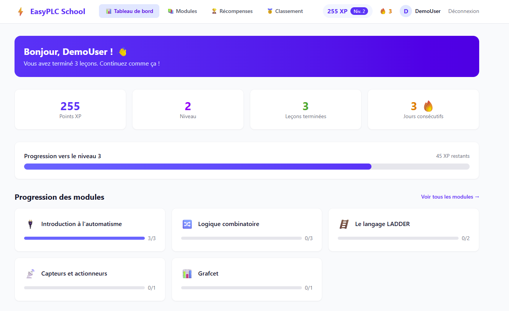
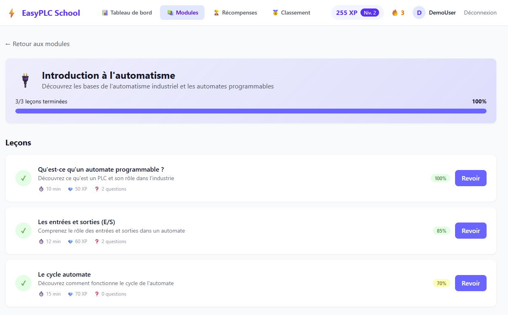
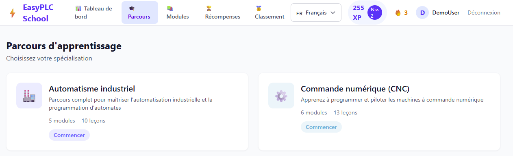
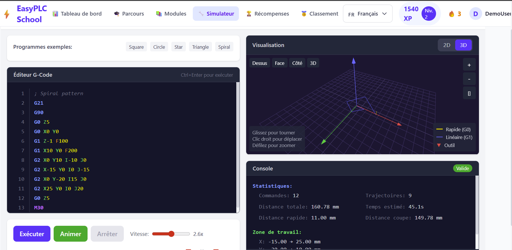
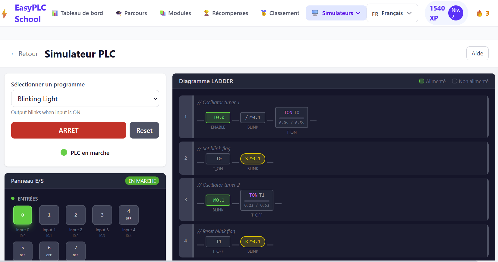
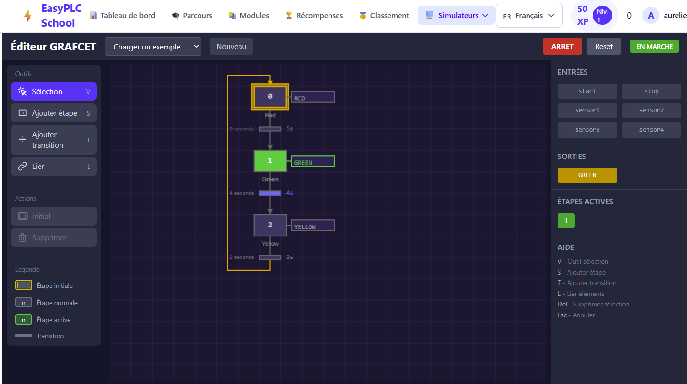

# EasyPLC School

Open source learning platform for industrial automation and programmable logic controllers (PLC).

> **Open source project**: This project welcomes contributions! Whether you're a developer, automation instructor, or industry professional, your contributions are welcome to enrich the educational content and improve the platform.

**Languages:** English | [Français](README.fr.md)

## Screenshots

### Overview


### Learning Module


### Learning Paths


### Interactive G-Code Simulator


### PLC / LADDER Simulator


---

## Learning Paths

EasyPLC School offers three specialization paths with a common foundation of core modules:

```
┌───────────────────────────────────────────────────────────────────────────────────────────────┐
│                                    LEARNING PATHS                                               │
├───────────────────────────────────────────────────────────────────────────────────────────────┤
│                                                                                                │
│   🏭 INDUSTRIAL AUTOMATION       🔧 CNC MACHINING                🔷 SIEMENS AUTOMATION        │
│   ━━━━━━━━━━━━━━━━━━━━━━━       ━━━━━━━━━━━━━━━━                 ━━━━━━━━━━━━━━━━━━━━━        │
│                                                                                                │
│   ├── Introduction *             ├── Introduction *             ├── Introduction *            │
│   ├── Combinational logic *      ├── Combinational logic *      ├── Combinational logic *     │
│   ├── Sensors/actuators *        ├── Sensors/actuators *        ├── LADDER language           │
│   ├── LADDER language            ├── CNC Introduction           ├── S7-1500 Introduction      │
│   └── GRAFCET                    ├── G-Code Programming         ├── TIA Portal Programming    │
│                                  └── Axes and interpolation     └── S7 Data Blocks            │
│                                                                                                │
│   * Core modules shared across paths                                                          │
│                                                                                                │
└───────────────────────────────────────────────────────────────────────────────────────────────┘
```

### Industrial Automation Path 🏭

This path covers the basics of industrial automation with programmable logic controllers (PLC):
- 5 progressive modules
- 10 lessons total
- Focus on LADDER and GRAFCET

### CNC Machining Path 🔧

This path specializes in CNC machine programming:
- 6 modules (3 core + 3 specialized)
- G-Code learning
- Mastering axis systems

### Siemens Automation Path 🔷

This path is dedicated to Siemens S7-1500 PLCs and the TIA Portal environment:
- 6 modules (3 core + 3 Siemens specialized)
- 6 specialized lessons with ASCII diagrams
- LAD, FBD, SCL programming
- Mastering data blocks (DB)

---

## Interactive Simulators

EasyPLC School includes three interactive simulators to practice the concepts learned.

### PLC / LADDER Simulator ⚡

A complete PLC simulator with real-time LADDER visualization.

```
┌─────────────────────────────────────────────────────────────────┐
│  PLC SIMULATOR                                                   │
├─────────────────────────────────────────────────────────────────┤
│                                                                  │
│  I/O PANEL                │  LADDER DIAGRAM                     │
│  ┌────────────────────┐   │  ┌────────────────────────────────┐ │
│  │ INPUTS             │   │  │                                │ │
│  │ [I0.0] [I0.1] ...  │   │  │  ──┤START├──┤STOP├──(MOTOR)── │ │
│  │  ⚡/🔒  ⚡/🔒       │   │  │        │      /│               │ │
│  │                    │   │  │  ──────┴MOTOR─┴────────────── │ │
│  │ OUTPUTS            │   │  │                                │ │
│  │ [Q0.0] [Q0.1] ...  │   │  │  Green rails = active flow    │ │
│  │   💡     ⚙️         │   │  │                                │ │
│  │                    │   │  └────────────────────────────────┘ │
│  │ TIMERS             │   │                                     │
│  │ [T0] ████░░ 3.2s   │   │                                     │
│  └────────────────────┘   │                                     │
│                                                                  │
└─────────────────────────────────────────────────────────────────┘
```

**Features:**
- Sample programs: Start/Stop, Traffic Light, Sequencer
- **Momentary/Toggle mode**: Click ⚡/🔒 above each input to switch modes
- Real-time power flow visualization (green rails)
- Timers with progress bar
- Different output types: lamps, motors, valves

**Available Programs:**
| Program | Description |
|---------|-------------|
| Start/Stop | Self-holding circuit with START/STOP buttons |
| Traffic Light | Sequence with timers |
| Sequencer | Sequential steps activated by buttons |

---

### GRAFCET Editor 📐

A visual editor for creating and simulating GRAFCET diagrams (Sequential Function Charts).



```
┌─────────────────────────────────────────────────────────────────┐
│  GRAFCET EDITOR                                        [RUN]    │
├─────────────────────────────────────────────────────────────────┤
│                                                                  │
│  TOOLS           │  CANVAS                    │  PROPERTIES     │
│  ┌────────────┐  │  ┌──────────────────────┐  │  ┌───────────┐  │
│  │ V Select   │  │  │     ╔═══╗            │  │  │ INPUTS    │  │
│  │ S Step     │  │  │     ║ 0 ║──Wait      │  │  │ [start]   │  │
│  │ T Transit. │  │  │     ╚═╤═╝            │  │  │ [stop]    │  │
│  │ L Link     │  │  │    ───┴─── start     │  │  │ [sensor1] │  │
│  │            │  │  │       │              │  │  │           │  │
│  │ ACTIONS    │  │  │     ┌─┴─┐            │  │  │ OUTPUTS   │  │
│  │ [Initial]  │  │  │     │ 1 │──Q1        │  │  │ Q1: ON    │  │
│  │ [Delete]   │  │  │     └─┬─┘            │  │  │           │  │
│  │            │  │  │    ───┴─── stop      │  │  │ STEPS     │  │
│  │ LEGEND     │  │  │       │              │  │  │ Active:   │  │
│  │ ╔═╗ Init.  │  │  │       └──▶ (return)  │  │  │ [0] [1]   │  │
│  │ ┌─┐ Normal │  │  └──────────────────────┘  │  └───────────┘  │
│  └────────────┘                                                  │
│                                                                  │
└─────────────────────────────────────────────────────────────────┘
```

**Features:**
- Create steps and transitions with drag-and-drop
- Link elements (step → transition → step)
- Real-time simulation with active step visualization
- Edit transition conditions (boolean, timer)
- Add actions to steps
- Pre-loaded examples: Simple Cycle, Timed Sequence, Parallel Branches, Traffic Light

**Keyboard Shortcuts:**
| Key | Action |
|-----|--------|
| V | Select tool |
| S | Add step |
| T | Add transition |
| L | Link elements |
| Del | Delete selection |
| Esc | Cancel |

---

### G-Code / CNC Simulator 🔧

A CNC programming simulator with 2D and 3D visualization.

```
┌─────────────────────────────────────────────────────────────────┐
│  G-CODE SIMULATOR                                                │
├─────────────────────────────────────────────────────────────────┤
│                                                                  │
│  EDITOR                │  3D VISUALIZATION                      │
│  ┌──────────────────┐  │  ┌────────────────────────────────────┐│
│  │ G21 G90          │  │  │           Z                        ││
│  │ G00 X0 Y0 Z5     │  │  │           │    ╱ Tool              ││
│  │ M03 S1200        │  │  │           │  ╱   path              ││
│  │ G01 Z-2 F100     │  │  │           │╱                       ││
│  │ G01 X50 F200     │  │  │     Y─────┼───────X                ││
│  │ G02 X80 Y30 R15  │  │  │          ╱│                        ││
│  │ G00 Z5           │  │  │        ╱  │  [Top] [Front]         ││
│  │ M05              │  │  │      ╱    │  [Side] [3D]           ││
│  │ M30              │  │  │                                    ││
│  └──────────────────┘  │  └────────────────────────────────────┘│
│                        │                                         │
│  [▶ Run] [⏸ Pause] [⏹ Stop] Speed: [████░░]                     │
│                                                                  │
└─────────────────────────────────────────────────────────────────┘
```

**Features:**
- Code editor with syntax highlighting
- 2D visualization (top, front, side) and 3D isometric view
- Tool path animation
- Statistics: total distance, estimated time, command count
- Animation speed control
- Sample programs: square, circle, complex machining

**Supported G-Codes:**
| Code | Description |
|------|-------------|
| G00 | Rapid positioning |
| G01 | Linear interpolation |
| G02 | Clockwise arc |
| G03 | Counter-clockwise arc |
| G90/G91 | Absolute/relative mode |
| G20/G21 | Inches/millimeters |

---

## Features

### User System
- Secure registration and login (JWT)
- Customizable user profile
- Individual progress tracking

### Gamification System
- **XP Points**: Earn points by completing lessons
- **Levels**: Progress and unlock new modules
- **Daily Streak**: Maintain your login streak
- **Rewards**: Badges and trophies to collect

### Leaderboard
- Global user ranking
- Period filters (week, month, all time)
- View your rank

### XP Point System

| Action | XP Earned |
|--------|-----------|
| Complete a lesson | 50-80 XP (based on score) |
| Badge unlocked | 25-100 XP bonus |
| Trophy earned | 150-200 XP bonus |

Level is calculated using: Total XP = 50 × level × (level + 1)

---

## Installation

### Prerequisites
- Node.js 18+
- npm or yarn

### Steps

1. **Clone the project**
```bash
git clone https://github.com/orelmi/easyplc-school.git
cd easyplc-school
```

2. **Install dependencies**
```bash
npm install
```

3. **Configure the database**
```bash
npx prisma generate
npx prisma db push
```

4. **Seed the database** (optional)
```bash
npm run db:seed
```

5. **Start the application**
```bash
npm run dev
```

The application will be available at:
- Frontend: http://localhost:5173
- Backend API: http://localhost:3001

## Demo Account

A demo account is automatically created during seeding:

| Field | Value |
|-------|-------|
| Email | `demo@easyplc.fr` |
| Password | `demo123` |

This account already has:
- 255 XP and level 2
- 3 completed lessons
- 3 unlocked rewards
- A 3-day streak

## Tech Stack

### Frontend
- React 18 + TypeScript
- Vite (build tool)
- Tailwind CSS
- React Router v6
- Zustand (state management)
- Three.js (3D visualization)

### Backend
- Node.js + Express
- TypeScript
- Prisma ORM
- SQLite
- JWT (authentication)
- bcrypt (password hashing)

## Available Scripts

| Command | Description |
|---------|-------------|
| `npm run dev` | Start frontend and backend in development mode |
| `npm run dev:client` | Start frontend only |
| `npm run dev:server` | Start backend only |
| `npm run build` | Production build |
| `npm run db:push` | Apply Prisma schema to DB |
| `npm run db:seed` | Seed DB with initial data |
| `npm run db:studio` | Open Prisma Studio (DB GUI) |

## Project Structure

```
easyplc-school/
├── prisma/
│   ├── schema.prisma    # Database schema
│   ├── seed.ts          # Seeding script + educational content
│   └── translations.ts  # Lesson and quiz translations (EN/ES)
├── server/
│   ├── index.ts         # Server entry point
│   ├── middleware/
│   │   └── auth.ts      # Authentication middleware
│   └── routes/
│       ├── auth.ts      # Authentication routes
│       ├── users.ts     # User routes
│       ├── modules.ts   # Module routes
│       ├── lessons.ts   # Lesson routes
│       ├── progress.ts  # Progress routes
│       ├── rewards.ts   # Rewards routes
│       ├── leaderboard.ts # Leaderboard routes
│       └── cursus.ts    # Learning path routes
├── src/
│   ├── components/
│   │   ├── Layout.tsx
│   │   ├── LanguageSelector.tsx
│   │   ├── LadderDiagram.tsx    # LADDER visualization
│   │   ├── PLCIOPanel.tsx       # PLC I/O panel
│   │   ├── GCodeCanvas.tsx      # 2D G-Code visualization
│   │   └── GCodeCanvas3D.tsx    # 3D G-Code visualization
│   ├── pages/
│   │   ├── Login.tsx
│   │   ├── Register.tsx
│   │   ├── Dashboard.tsx
│   │   ├── CursusSelect.tsx
│   │   ├── CursusDetail.tsx
│   │   ├── Modules.tsx
│   │   ├── ModuleDetail.tsx
│   │   ├── Lesson.tsx
│   │   ├── Rewards.tsx
│   │   ├── Leaderboard.tsx
│   │   ├── Profile.tsx
│   │   ├── PLCSimulator.tsx     # PLC simulator page
│   │   └── GCodeSimulator.tsx   # G-Code simulator page
│   ├── lib/
│   │   ├── api.ts               # API client
│   │   ├── plc-simulator.ts     # PLC simulation engine
│   │   └── gcode-parser.ts      # G-Code parser
│   ├── i18n/
│   │   ├── index.ts             # i18n configuration
│   │   └── locales/             # Translation files (fr, en, es)
│   ├── store/
│   │   └── authStore.ts         # Zustand store
│   ├── App.tsx
│   ├── main.tsx
│   └── index.css
├── package.json
└── vite.config.ts
```

## API Endpoints

### Authentication
| Method | Endpoint | Description |
|--------|----------|-------------|
| POST | `/api/auth/register` | Register |
| POST | `/api/auth/login` | Login |
| GET | `/api/auth/me` | Current user |

### Modules & Lessons
| Method | Endpoint | Description |
|--------|----------|-------------|
| GET | `/api/modules` | List modules |
| GET | `/api/modules/:id` | Module details |
| GET | `/api/lessons/:id` | Lesson content |
| POST | `/api/lessons/:id/submit` | Submit quiz |

### Learning Paths (Cursus)
| Method | Endpoint | Description |
|--------|----------|-------------|
| GET | `/api/cursus` | List paths with progress |
| GET | `/api/cursus/:id` | Path details with modules |

### Progress & Rewards
| Method | Endpoint | Description |
|--------|----------|-------------|
| GET | `/api/progress` | User progress |
| GET | `/api/rewards` | Rewards list |
| GET | `/api/leaderboard` | User rankings |

## Contributing

This project is open source and welcomes community contributions!

### How to Contribute

1. **Fork** the project
2. Create a branch for your feature (`git checkout -b feature/new-feature`)
3. Commit your changes (`git commit -m 'Add new feature'`)
4. Push to the branch (`git push origin feature/new-feature`)
5. Open a **Pull Request**

### Types of Contributions Sought

- **Educational content**: New modules, lessons, exercises
- **Features**: GRAFCET editor, offline mode
- **UI/UX improvements**: Accessibility, responsive design, animations
- **Documentation**: Tutorials, user guides, translations
- **Tests**: Unit tests, integration tests
- **Fixes**: Bugs, typos, optimizations

### Contribution Ideas

- [x] ~~Add interactive PLC simulator~~ ✅ PLC simulator with real-time LADDER visualization
- [x] ~~Create visual GRAFCET editor~~ ✅ Editor with real-time simulation
- [x] ~~Add animations for LADDER diagrams~~ ✅ Animated power flow in PLC simulator
- [ ] Implement exam mode
- [x] ~~Add multi-language support (EN, ES, DE)~~ ✅ FR, EN, ES available
- [x] ~~Add learning paths~~ ✅ Automation and CNC
- [ ] Create practical programming exercises
- [x] ~~Add interactive G-Code simulator~~ ✅ 2D/3D visualization with Three.js

### Enriching Educational Content

Lesson content is defined in `prisma/seed.ts`. To add content:

1. Open the `prisma/seed.ts` file
2. Add your lessons following the existing structure
3. Run `npm run db:seed` to apply changes

## License

MIT - See the [LICENSE](LICENSE) file for details.

---

Developed with passion for industrial automation training.
